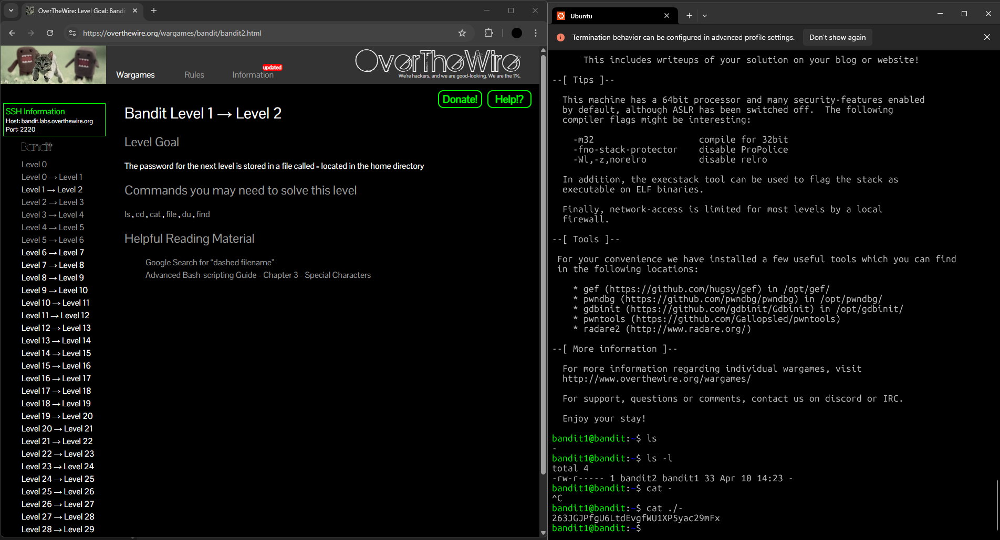

## Bandit Level 1 → Level 2: My Approach

### **Goal**

Find the password for the next level, which is stored in a file named `-` in the home directory.

---


### **My Steps**

1. **List files in the directory:**
   I ran `ls` to see what files were present and spotted a file named `-`.

2. **Check file details:**
   I used `ls -l` to confirm the file’s existence and permissions.

3. **Read the file with a special name:**
   Since the filename was just a single dash (`-`), I couldn’t use `cat -` because that would make `cat` expect input from my keyboard.
   To tell the shell I wanted to read the actual file, I used:

   ```
   cat ./-
   ```

   The `./` specifies the current directory, making sure `cat` treats the dash as a filename, not an option.

4. **Get the password:**
   The password was displayed in the terminal, ready for me to use for the next level.

---


**Reflection:**
This challenge showed me how Linux handles filenames that can be mistaken for command options, and how using `./` helps avoid confusion when dealing with tricky filenames.

---




