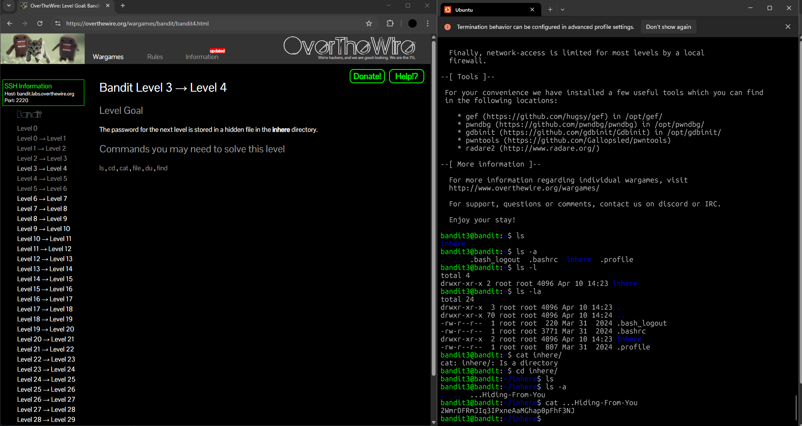

## Bandit Level 3 → Level 4: My Approach

### **Goal**

Find the password for the next level, hidden inside a file in the `inhere` directory.

---

### **My Steps**

1. **List files and directories:**
   I used `ls` to look for anything new or unusual in the home directory and found a directory called `inhere`.

2. **Explore the `inhere` directory:**
   I first tried `cat inhere/` but realized it’s a directory, not a file.
   I then changed into the `inhere` directory using:

   ```
   cd inhere
   ```

3. **Reveal hidden files:**
   I used `ls -a` inside the `inhere` directory to see all files, including hidden ones (files that start with a dot).
   I found a file called `...Hiding-In-Here`.

4. **Read the hidden file:**
   I used:

   ```
   cat ...Hiding-In-Here
   ```

   to display the contents of the hidden file and retrieve the password for the next level.

---


**Reflection:**
This level taught me to look out for hidden files and directories using `ls -a`, and reinforced the importance of exploring the file system carefully in Linux environments.

---




