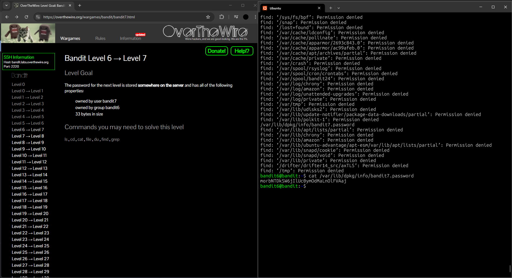

## Bandit Level 6 → Level 7: My Approach

### **Goal**

Find the password for the next level, which is stored somewhere on the server in a file that meets all of these criteria:

* Owned by user `bandit7`
* Owned by group `bandit6`
* 33 bytes in size

---

### **My Steps**

1. **Search the whole server:**
   I used the `find` command from the root directory to look for files with the specific owner, group, and size:

   ```
   find / -type f -user bandit7 -group bandit6 -size 33c
   ```

   This command generated a lot of "Permission denied" messages, but it still allowed me to spot the file I was looking for in the output.

2. **Identify the password file:**
   The command showed the file path:
   `/var/lib/dpkg/info/bandit7.password`

3. **Read the password:**
   I ran:

   ```
   cat /var/lib/dpkg/info/bandit7.password
   ```

   to display the contents and get the password for the next level.

---

**Reflection:**
Even though the command produced many "Permission denied" messages, I learned how to use the `find` command to search by file ownership and size, which is really useful for system administration and troubleshooting.

---




