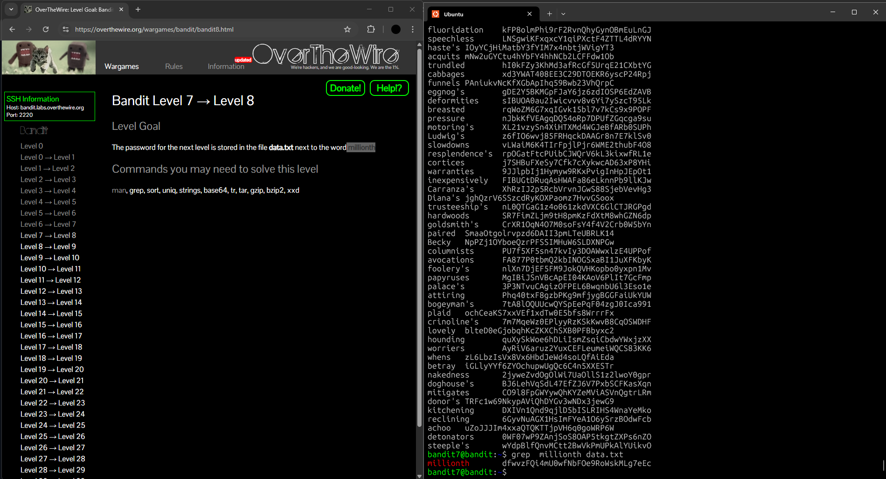

## Bandit Level 7 → Level 8: My Approach

### **Goal**

Find the password for the next level, which is stored in the file `data.txt` next to the word `millionth`.

---

### **My Steps**

1. **List files in the directory:**
   I started by running `ls` to see what files were available. I spotted a file named `data.txt`.

2. **View the file contents:**
   Out of curiosity, I used `cat data.txt` to see what was inside. The file contained a long list of words, making it clear that searching by eye would be too slow.

3. **Search for the specific word:**
   To quickly find the line with the word `millionth`, I used:

   ```
   grep millionth data.txt
   ```

   This command instantly displayed the line containing `millionth` and the password right next to it.

---

**Reflection:**
This challenge reminded me of the power of combining basic file navigation (`ls`, `cat`) with search tools like `grep` to efficiently extract information from large files.

---



