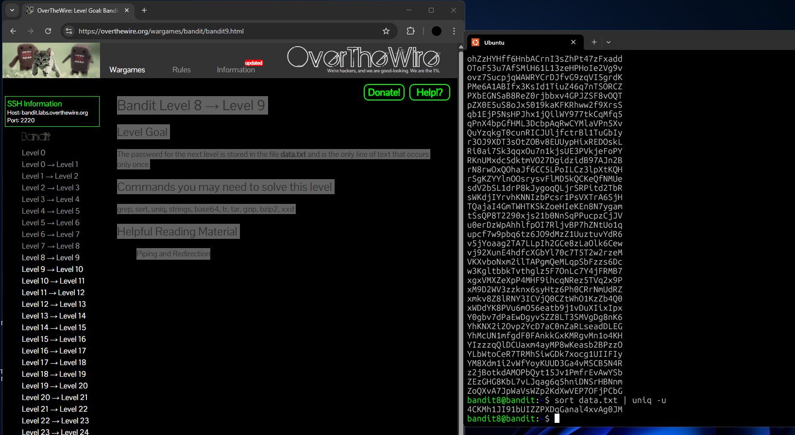

## Bandit Level 8 → Level 9: My Approach

### **Goal**

Find the password for the next level, which is stored in the file `data.txt` and is the only line of text that occurs just once.

---

### **My Steps**

1. **Check the file contents:**
   I started by viewing `data.txt` and saw it contained a long list of seemingly random strings.

2. **Try to find the unique line:**
   At first, I used the command:

   ```
   uniq -u data.txt
   ```

   I thought this would show me the line that appears only once. But I quickly realized that `uniq -u` only finds unique lines **if they are next to each other**—it only works properly on sorted data.

3. **Sort and filter for the unique line:**
   To make sure all duplicate lines were next to each other, I used:

   ```
   sort data.txt | uniq -u
   ```

   This sorted all the lines, so duplicates were grouped together, and then `uniq -u` could correctly display the line that appeared just once—the password for the next level.

---

**Reflection:**
This challenge taught me the importance of sorting data before using `uniq` to accurately find unique lines in a list. It was a good reminder to think about how command-line tools process data step by step.

---



